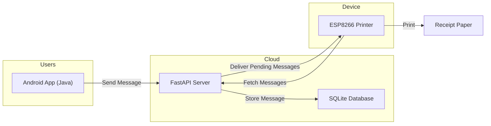
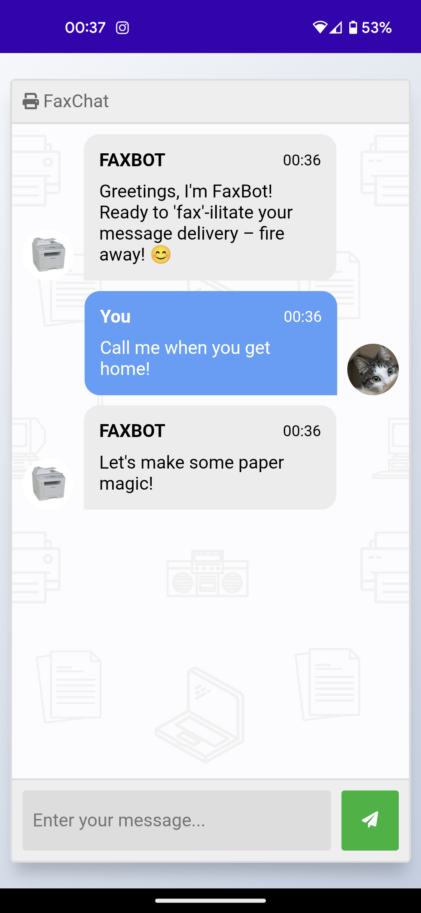
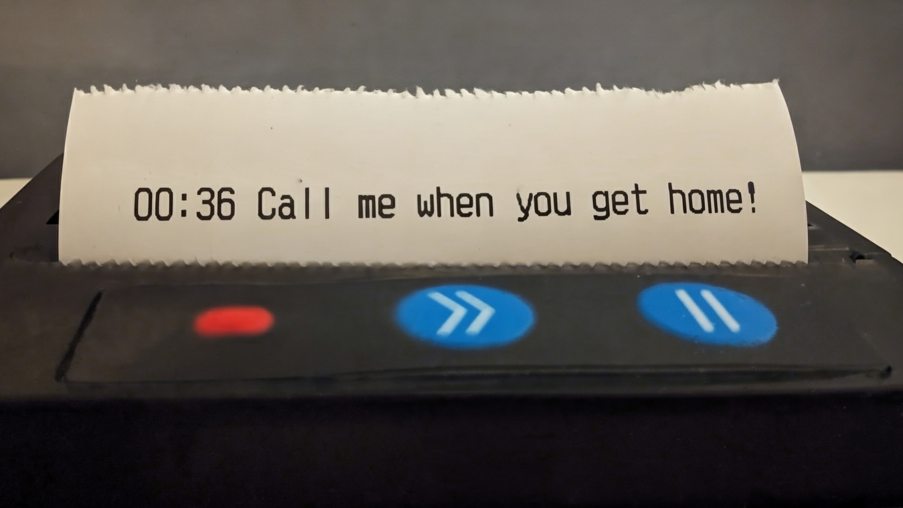

# FaxChat

**FaxChat** is a hobby project that brings back the charm of printed messages in a modern IoT form.  
It’s an **ESP8266-powered receipt printer** that lets your family and friends send you messages via a simple mobile app or web interface.  
When you’re focused in your distraction-free workspace, messages arrive as printed notes instead of phone notifications.

## Architecture

---

## Overview

FaxChat consists of four main parts:

1. **Mobile App**: A Java-based Android app that allows users to send text messages.  
2. **PWA (Progressive Web App)**: A lightweight web interface for sending messages from any browser.  
3. **API Server**: A FastAPI backend hosted on an Oracle Cloud VM, handling message storage and delivery.  
4. **ESP8266 Printer Device**: Periodically checks for new messages and prints them on thermal receipt paper.

The **API** exists to ensure no message is ever lost. Even if the printer is offline or there’s a temporary network issue.  
Messages are stored in the API’s SQLite database until the printer successfully retrieves and prints them.

---

## How It Works

1. A user sends a message using the FaxChat Android app or PWA.  
2. The message is sent to the API server, which stores it in a small SQLite database.  
3. The ESP8266 printer periodically connects to the API and retrieves any new messages.  
4. Each message is printed on receipt paper in real time.  
5. If the printer is offline, messages remain stored in the database and are printed automatically once it reconnects.

---

## Demo

### Mobile App  

### Physical Device  

---

## Tech Stack

- **Hardware:** ESP8266 microcontroller, thermal receipt printer  
- **Firmware:** Arduino (ESP8266 core)  
- **Backend:** FastAPI (Python)  
- **Database:** SQLite  
- **Hosting:** Oracle Cloud VM  
- **Mobile App:** Java (Android)  

---

## Features

- Reliable message storage via API (never miss a message, even when offline)  
- Simple message delivery without distractions  
- Real-time printing when the device is online  
- Lightweight FastAPI backend with SQLite storage  
- Easy to set up and customize for your own use

